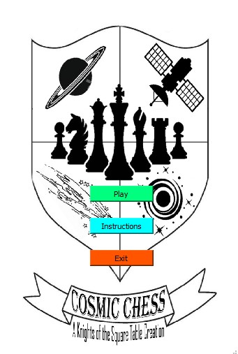
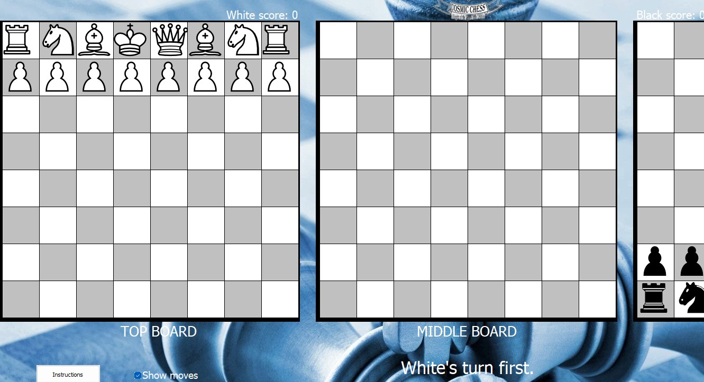

layout: page
title: "Personal-Projects"
permalink: /myprojects

## University Projects
### 3D Chess Game
&ensp; &ensp; This project was my capstone project for my Bachelors degree. It spanned
the whole spring semester, where me and my 3 other teammates diligently worked to
develop both the game engine and interface in C++, which was a relatively new language
for the majority of us. It includes the following:
- Developed using QT (c++) tools
- Objected-Oriented class hierarchies
- Complex functions and algorithms used for gameplay
- A working 3D chess game that can be played between 2 people

The following images show the interfaces for the game:

---

## Personal Projects

### Personal Github Pages Site

&ensp; &ensp; This site is one of my first personal projects with the intent to
expose me to elements of web development like markdown, css, and html.
